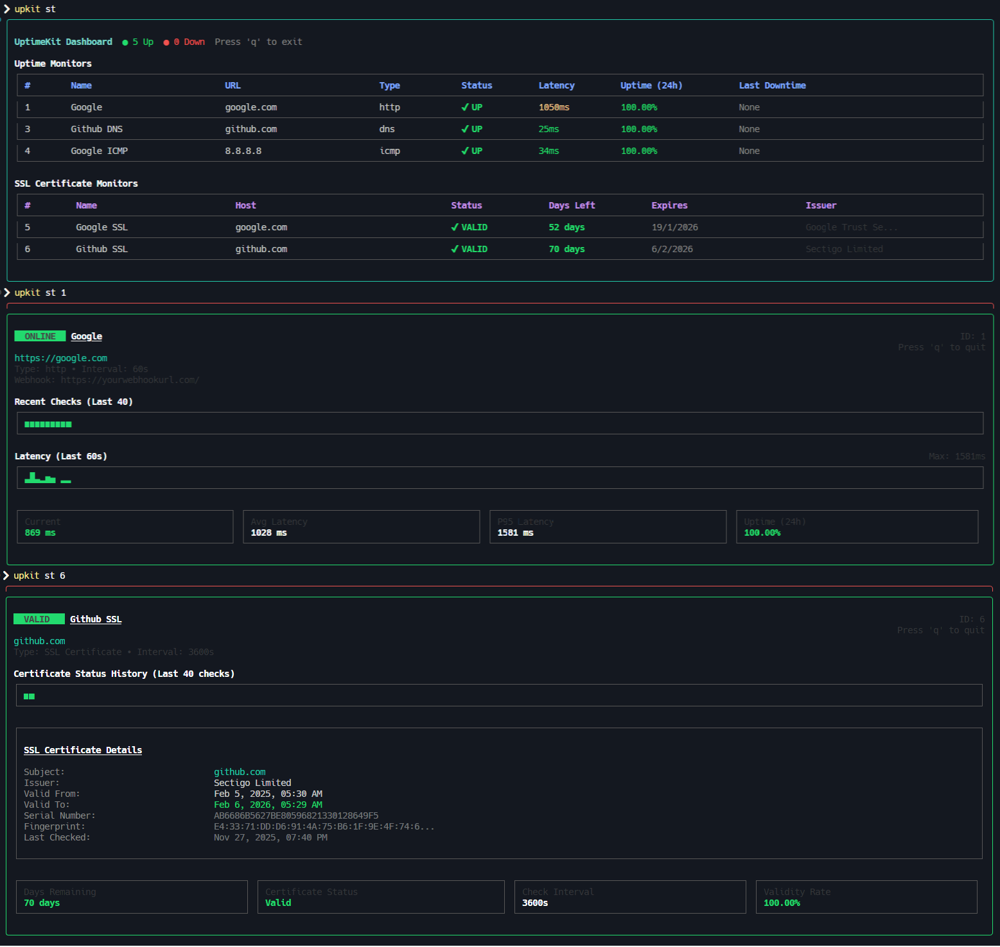

<div align="center">

# UptimeKit 🖳

**Production-ready uptime monitoring from your terminal**

[](https://www.npmjs.com/package/uptimekit)
[](https://www.npmjs.com/package/uptimekit)
[](https://opensource.org/licenses/MIT)

</div>


---

## Installation

```bash
npm install -g uptimekit
```

## Quick Start

```bash
# Start the monitoring daemon
upkit start

# Add a monitor
upkit add https://google.com -t http -i 30 -n "Google"

# View dashboard
upkit status

# View detailed stats
upkit status 1
```

## Features

- **Background Daemon** - Continuous monitoring without keeping terminal open
- **Live Dashboard** - Real-time TUI with status, latency, and uptime metrics
- **Multi-Protocol** - HTTP/HTTPS, ICMP Ping, and DNS monitoring
- **Desktop Notifications** - Get notified when monitors go down or come back up
- **Rich Metrics** - Latency sparklines, P95, status history timeline
- **Lightweight** - Minimal resource usage with SQLite storage

## Commands

### Daemon
```bash
uptimekit start          # Start monitoring daemon
upkit start              # alias

uptimekit stop           # Stop daemon
upkit stop               # alias
```

### Monitors
```bash
uptimekit add <url> -t <type> -i <interval> -n <name>
upkit add <url> -t <type> -i <interval> -n <name>    # alias

uptimekit status         # View all monitors
upkit st                 # alias

uptimekit status <id>    # View monitor details
upkit st <id>            # alias

uptimekit edit <id>      # Edit monitor
upkit edit <id>          # alias

uptimekit delete <id>    # Delete monitor
upkit del <id>           # alias

uptimekit clear          # Clear all monitors
upkit clr                # alias

uptimekit reset          # Reset the database
upkit reset              # alias
```

### Notifications
```bash
uptimekit notif enable   # Enable desktop notifications
upkit notif enable       # alias

uptimekit notif disable  # Disable desktop notifications
upkit notif disable      # alias

uptimekit notif status   # Check notification status
upkit notif status       # alias
```

### Options for `add` and `edit`
- `-t, --type` - Monitor type: `http`, `icmp`, `dns`
- `-i, --interval` - Check interval in seconds (default: 60)
- `-n, --name` - Custom name
- `-u, --url` - URL/Host (for `edit` command)

## Monitor Types

**HTTP/HTTPS** - Website availability
```bash
upkit add https://example.com -t http -i 30
```

**ICMP Ping** - Server reachability
```bash
upkit add 8.8.8.8 -t icmp -i 10
```

**DNS** - Domain resolution
```bash
upkit add google.com -t dns -i 60
```

## Examples

```bash
# Monitor a website every 30 seconds
upkit add https://mysite.com -t http -i 30 -n "My Website"

# Ping Google DNS every 10 seconds
upkit add 8.8.8.8 -t icmp -i 10 -n "Google DNS"

# Check DNS resolution every minute
upkit add github.com -t dns -i 60 -n "GitHub DNS"

# View all monitors
upkit st

# View detailed stats for monitor #1
upkit st 1

# Delete monitor #1
upkit del 1

# Edit monitor #1 (interactive)
upkit edit 1

# Edit monitor #1 (flags)
upkit edit 1 -i 120 -n "Updated Name"
```

## Dashboard

The dashboard shows:
- Monitor status (UP/DOWN)
- Current latency
- 24-hour uptime percentage
- Last downtime

## Detail View

The detail view includes:
- Status timeline (last 40 checks)
- Latency sparkline (last 60 seconds)
- Current, average, and P95 latency
- 24-hour uptime percentage


## Requirements

- Node.js 16+
- Linux, macOS, or Windows


## Documentation

Full documentation: [GitHub Repository](https://github.com/abhixdd/UptimeKit-CLI)

## Contributing

Contributions are welcome! Please read our [Contributing Guidelines](CONTRIBUTING.md) for details on how to submit pull requests, report issues, and contribute to the project.

## License

UptimeKit is made available under the terms of the [MIT License](https://opensource.org/licenses/MIT).

Copyright (c) 2025 [abhixdd](https://github.com/abhixdd)

---


⭐ [Star on GitHub](https://github.com/abhixdd/UptimeKit-CLI) • 🐛 [Report Bug](https://github.com/abhixdd/UptimeKit-CLI/issues) • 💡 [Request Feature](https://github.com/abhixdd/UptimeKit-CLI/issues)


